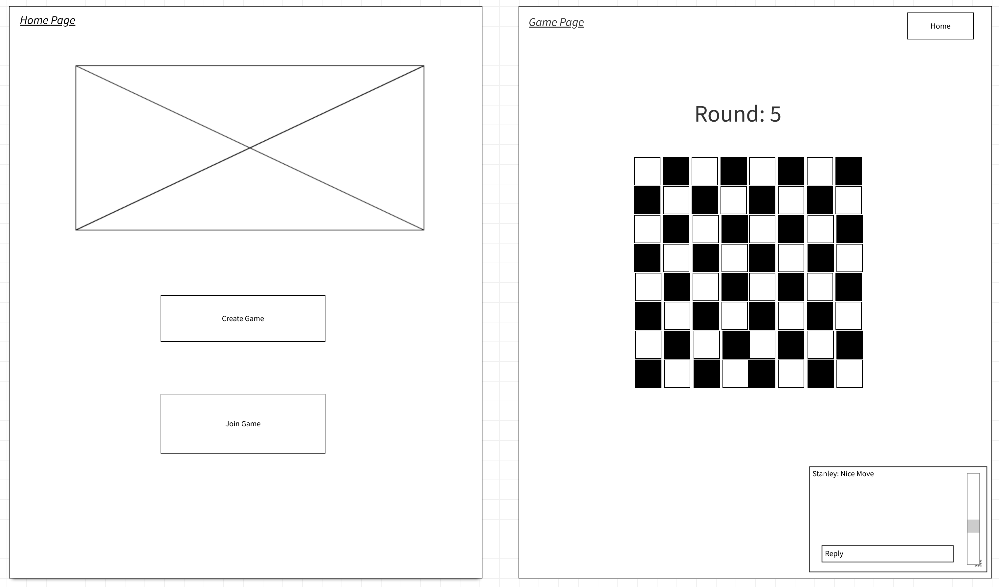
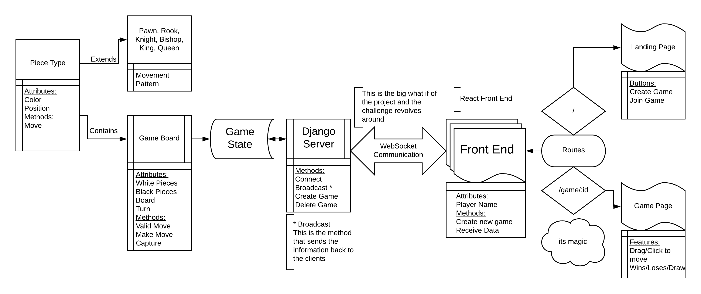

# KnightTakesPywn - CF401 Python Final Project

| | |
|:-|:-|
| *Authors:*      | Chris Ceder, Chris Stanely, Travis Williams, Aaron Imbrock |
| *Create Date:* | 02/07/2020    |
| *Language:*    | Python 3.8    |
| *Other technologies used:*    | WebSockets, Dango 3 ASGI, Material-UI, React |

React, django asgi, material-ui, websocket based online Chess Game allowing two people to play chess against each other from their own browsers while having the option to chat. Games will be shared using a preshared unique URL for each game. UI will show a chessboard, pieces on the board, and allow each player to move the chess pieces.

## Minimum Viable Product

- A game board that updates in both browsers when either player makes a move.
- All pieces follow appropriate game logic.
- Be able to create game instances with a key to let others join.

## Stretch Goals

- Each player has their side of board “facing” them.
- Player can select a display name
- Full Game over and restart option
- Display Captured Pieces
- Overlay showing available moves for a given piece
- Full Chess Logic (Castle, Special Pawn Capture)
- Better game/site security
- In game chat

## UI Wireframe

## Domain Model

